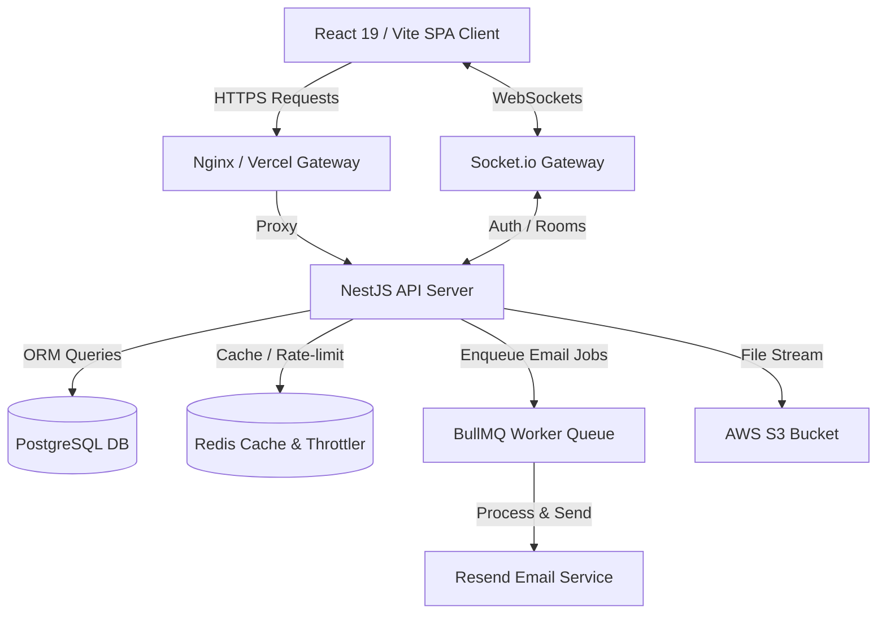

# Product Requirement Document (PRD) - NovaBlog

## 1. Document Control & Overview
- **Document Title:** Product Requirement Document (PRD) - NovaBlog Blogging Platform
- **Version:** 1.0.0
- **Status:** Draft
- **Target Audience:** Developers, Designers, Product Stakeholders
- **Created By:** Antigravity AI
- **Created Date:** June 23, 2026

---

## 2. Executive Summary
NovaBlog is a modern, high-performance, developer-centric blogging platform designed to facilitate rich knowledge sharing, collaborative reading, and community engagement. Inspired by platforms like Medium and dev.to, NovaBlog combines a seamless, distraction-free writing experience with a robust suite of social mechanisms, real-time feedback loops, and advanced security configurations.

The system is built on a decoupled architecture using a React 19 / Vite frontend for smooth, fast client interactions, and a NestJS backend utilizing Prisma ORM with PostgreSQL for persistent storage, Redis for high-speed caching and rate-limiting, and BullMQ for background job queueing.

---

## 3. Product Vision & Strategy
*   **Core Value Proposition:** Provide developers and tech enthusiasts with an aesthetically stunning, lightning-fast platform that honors clean markdown/rich-text writing, supports threaded discussion, and empowers authors with individual analytics.
*   **Key Differentiators:**
    1.  **Immersive Rich Text:** A premium writing dashboard utilizing the TipTap editor with support for complex formatting, code snippets, blockquotes, and media.
    2.  **Robust Safety & Auth:** High-end security, including multi-factor authentication (2FA), token rotation, rate-limiting, and account lockouts.
    3.  **Real-Time Engagement:** WebSockets-based live notification system for instant community interactions.
    4.  **Decoupled & Scalable Infrastructure:** Offloading resource-heavy actions (like mail delivery) to background worker queues to ensure the main application thread remains highly responsive.

---

## 4. Target Personas
### 4.1. The Reader (e.g., "Devin, the Frontend Engineer")
*   **Needs:** Easy exploration of articles, searchability by tag/category, personalization (following authors), saving articles for later (bookmarks), showing support (likes), and commenting on specific sections.
*   **Pain Points:** Intrusive advertisements, slow load times, poor typography, lack of distraction-free reading, and flat comment threads that make discussion hard to follow.

### 4.2. The Author (e.g., "Sarah, the Tech Lead")
*   **Needs:** A powerful, reliable, and autosaved writing canvas, ability to upload thumbnail banners, manage post lifecycles (Draft, Published, Archived), tag articles correctly, and inspect performance metrics (views, comments, bookmarks).
*   **Pain Points:** Clunky rich-text editors that break markdown, complicated media uploads, inability to track which posts perform well, and high barrier to building a following.

---

## 5. Functional Requirements (Detailed Specifications)

### 5.1. Authentication, Security & User Identity
The system employs a multi-layered security model to protect user data and maintain API integrity.
*   **JWT Access/Refresh Flow:** 
    *   On successful login, the server issues a short-lived Access Token (e.g., 15m) and a long-lived Refresh Token (e.g., 7d).
    *   The client stores these securely in `localStorage`.
    *   The frontend Axios client intercepts `401 Unauthorized` responses, automatically requests a new access token via `/auth/refresh-token`, and retries the original request seamlessly.
*   **Account Lockout & Brute-Force Defense:**
    *   Tracks failed login attempts.
    *   Locks the account for a designated period (`lockedUntil`) after a set threshold of failures.
*   **Two-Factor Authentication (2FA):**
    *   Supports TOTP (Time-based One-Time Password) configuration.
    *   Users can generate a 2FA secret and toggle 2FA on/off within their settings.
*   **Password Reset Flow:**
    *   Generates secure tokens with expiry (`resetPasswordToken`, `resetPasswordExpires`).
    *   Sends reset links using the Resend email provider.
*   **Profile Management:**
    *   Allows updating profile details (first/last name, bio, social URLs like website/github).
    *   Supports a custom `techStack` array (e.g., tags of languages/frameworks the user specializes in).
    *   Multer-based profile avatar uploads stored securely in AWS S3.
    *   Admin-governed `isVerified` and `isActive` states.

### 5.2. Content Creation & Lifecycle (Blog Module)
The core content generation pipeline.
*   **TipTap Rich Text Editor:**
    *   Supports custom formatting, links, headings, lists, code blocks, and images.
    *   Ensures clean HTML is generated and sanitized on the server before database insertion to prevent XSS.
*   **Metadata & SEO Optimization:**
    *   Automatic slug generation from titles (slugified and unique via cuid suffix).
    *   Reading time calculation based on word count.
    *   Optional excerpt/summary for previews.
    *   Category and multiple Tag associations.
*   **Banners & Media:**
    *   Supports uploading a blog thumbnail image, processed on the backend and uploaded directly to AWS S3.
*   **Lifecycle States:**
    *   `DRAFT`: Visible only to the author in their private workspace.
    *   `PUBLISHED`: Publicly visible, included in lists, search indexes, and follower feeds. Sets `publishedAt`.
    *   `ARCHIVED`: Retained in the database but hidden from public feeds and search results.

### 5.3. Engagement & Social Interaction Modules
Building community and interaction pathways.
*   **Threaded Comment System:**
    *   Users can comment on any published article.
    *   Supports nested, hierarchical comment replies (infinite depth support via self-referential relations, though UI renders up to readable levels).
    *   Authors and comment creators can update or delete their comments.
*   **Likes Engine:**
    *   Toggle-based blog liking.
    *   Ensures idempotent behavior (a user can only like a blog once).
    *   Synchronized like counts cached or queried efficiently.
*   **Bookmark Workspace:**
    *   Users can bookmark posts to read later.
    *   Private "My Bookmarks" dashboard showing bookmarked articles sorted by date added.
*   **Follow Network:**
    *   Users can follow other authors.
    *   Powers the customized personal "Feed" page, aggregating posts written by followed creators.

### 5.4. Real-Time Notification Center
Keeps users active and connected to community actions.
*   **Notification Types:**
    *   `LIKE`: Triggered when someone likes the user's blog.
    *   `COMMENT`: Triggered when someone comments on the user's blog or replies to their comment.
    *   `FOLLOW`: Triggered when another user follows them.
    *   `BLOG_PUBLISHED`: Triggered for followers when a creator publishes a new blog post.
*   **Delivery Channels:**
    *   **In-Database:** Stored in the `Notification` table with an `isRead` flag.
    *   **WebSockets (Socket.io):** Real-time, authenticated gateway pushes notifications instantly to the user's client if they are online.
    *   **Email Queue (BullMQ):** Offloaded background job queue sends emails for critical notifications.

### 5.5. Analytics Module
Empowering authors with performance data.
*   **Blog Analytics tracking:**
    *   Maintains a dedicated `BlogAnalytics` model linked 1:1 with each `Blog`.
    *   Tracks: `totalViews`, `totalLikes`, `totalComments`, `totalBookmarks`.
    *   Updated on read/write actions (incremented asynchronously or on action).

---

## 6. User Interface & User Experience (UI/UX) Specifications
The frontend is built as a highly responsive, modern, premium Single Page Application (SPA) with sleek styling (dark-themed by default), glassmorphic card overlays, and dynamic animations (via Framer Motion).

### 6.1. Core Pages & Routes Map
1.  **Home Page (`/`):**
    *   *Hero Section:* Engaging introduction, bold typography, search bar, and primary CTA (Start Writing / Explore).
    *   *Curated Insights:* List of featured and highly-viewed articles.
    *   *Trending Tags:* Interactive pill-shaped tags to filter articles.
    *   *Top Contributors:* Showcases highly active authors with follower counts and bio highlights.
    *   *Newsletter Call-to-Action:* Styled subscription form.
2.  **Explore Page (`/explore`):**
    *   Comprehensive list of all published blogs with server-side pagination, search queries, category filters, and tag filtering.
3.  **Personalized Feed Page (`/feed`):**
    *   Chronological list of articles from followed creators. Fallbacks suggest trending articles if the feed is empty.
4.  **Blog Details Page (`/post/:id`):**
    *   Clean reading environment with a progress scroll bar.
    *   Author info card with follow/unfollow action.
    *   Floating or sticky interactive panel (Like count, bookmark toggle, comments button).
    *   Threaded comment section showing avatars, timestamps, and nested replies.
5.  **Write / Edit Page (`/write`):**
    *   Focused writing mode. Left-side editor canvas, right-side metadata drawer.
    *   Metadata drawer includes title, excerpt, category dropdown, tag adder, thumbnail image dropzone, status select (Draft/Published/Archived), and Save/Publish button.
6.  **My Blogs Dashboard (`/my-blogs`):**
    *   Tabbed interface for: *Published*, *Drafts*, *Archived*.
    *   Quick actions: Edit, delete, view analytics, change status.
    *   Visual badges indicating reading time, views, and comments.
7.  **Settings Page (`/profile/settings`):**
    *   Tabbed settings:
        *   *Profile:* Avatar crop/upload, name, username, bio, website/GitHub links, tech stack manager.
        *   *Security:* Password change form, 2FA setup with QR code scanner/secret key toggle.
        *   *Preferences:* Light/Dark theme toggle, font scale slider (dynamic resize of the application's base rem units).
8.  **Public Profile Page (`/profile/:username`):**
    *   A card displaying the creator's avatar, bio, tech stack pills, social links, follower/following counts, and an active "Follow" button.
    *   A list of all publicly published blogs by this author.

---

## 7. Technical Architecture & Data Flow

### 7.1. Technology Stack
*   **Frontend Client:** React 19, Vite, Tailwind CSS, Axios, TipTap (rich text), Framer Motion, React Hot Toast.
*   **Backend Server:** NestJS, TypeScript, Throttler (rate-limiting via Redis).
*   **Database & ORM:** PostgreSQL, Prisma ORM.
*   **Caching & Queueing:** Redis, BullMQ (background job queueing for email notifications).
*   **Third-Party Integrations:** AWS S3 (multipart image uploads), Resend (transactional emails).

### 7.2. System Architecture & Information Flow Diagram

### 7.3. Database Model Definitions
The database schema consists of several interconnected models:
*   `User`: Represents the entity of an author/reader.
*   `Blog`: Content model created by a user, belonging to a `Category` and associated with multiple `Tags` via `BlogTag`.
*   `Comment`: Hierarchical entity referencing a `Blog` and a `User`, with a self-referential `parentId`.
*   `Like`: Joining table mapping `User` to `Blog` for unique likes.
*   `Bookmark`: Joining table mapping `User` to `Blog` for saving articles.
*   `Category`: Administrative taxonomy for blogs.
*   `Tag`: Dynamic tags for categorizing technical topics.
*   `Follow`: Self-referential joining table mapping `followerId` and `followingId`.
*   `Notification`: Represents user-specific notifications (`LIKE`, `COMMENT`, `FOLLOW`, `BLOG_PUBLISHED`).
*   `BlogAnalytics`: Metrics tracking for each blog post.

---

## 8. Non-Functional Requirements (NFRs)

### 8.1. Performance & Speed
*   **Server Response Times:** API response times for cached reads (e.g., home page feed, popular blogs) must be under 100ms. Non-cached relational queries must resolve in under 200ms.
*   **Cache Strategy:** Leverage Redis to cache high-traffic, semi-static endpoints such as the trending tags, top contributors list, and public profile views.
*   **Asset Optimization:** Uploaded thumbnails and avatars must be optimized/compressed to minimize bandwidth consumption and speed up page load times.

### 8.2. Security & Compliance
*   **Data Encryption:** All sensitive information, specifically passwords, must be hashed using `bcrypt` (rounds = 10) before database storage.
*   **Token Rotation & Security:** Access tokens are short-lived. Refresh tokens are stored securely in `localStorage` or `HttpOnly` cookies. Refresh tokens must be rotated or invalidated upon logout.
*   **API Protection:** 
    *   Rate limiting implemented globally (100 requests per minute per IP using Redis Throttling).
    *   Strict CORS configurations allowing only trusted client origins.
    *   Server-side validation using NestJS `ValidationPipe` with DTOs to enforce schema boundaries.
*   **Sanitization:** All content generated in the TipTap editor must be sanitized on the server to prevent Cross-Site Scripting (XSS) attacks.

### 8.3. Reliability & Scalability
*   **Asynchronous Job Processing:** Offload all heavy computational tasks, such as sending registration verification codes or password reset links, to the BullMQ redis-backed background worker queue.
*   **Database Integrity:** Enforce foreign key constraints and cascade deletions on relational database levels (e.g., deleting a blog cascades down to delete its likes, comments, and analytics).
*   **Docker Containerization:** Fully containerized setup via Docker and Docker Compose to guarantee environment consistency across development, staging, and production.

### 8.4. SEO & Accessibility
*   **SEO Optimization:** Blogs must support search-engine-friendly, clean slugs, custom meta descriptions from post excerpts, and proper HTML5 semantic tagging (`<article>`, `<header>`, `<nav>`, `<h1>` hierarchy).
*   **Responsive Web Design (RWD):** Full mobile, tablet, and desktop responsiveness.
*   **Accessibility (A11y):** Form fields must have corresponding labels, buttons must have descriptive roles, and color contrasts must adhere to WCAG AA standards. Interactive elements must support font resizing smoothly without breaking layouts.

---

## 9. Testing & Verification Plan

### 9.1. Automated Testing
*   **Unit & Integration Tests:**
    *   NestJS backend unit tests covering auth validation, blog creation state transitions, and comment nested reply creation logic.
    *   Command: `npm run test` and `npm run test:cov` (for coverage reporting).
*   **E2E Tests:**
    *   Testing of critical user paths (Register -> Login -> Write Blog -> Publish -> Read -> Like -> Comment).
    *   Command: `npm run test:e2e`.

### 9.2. Manual Verification
*   Verify Socket.io connection by opening multiple browser tabs, liking a blog post in one tab, and verifying that the author receives a real-time notification in the other tab.
*   Validate the token refresh flow by manually expiring the access token in local storage, performing a write action, and ensuring the request completes successfully without redirecting the user to the login screen.
*   Test responsive scaling by verifying readability on simulated mobile devices (iPhone, Pixel) and trying the font scaling preference slider in settings.

---

## 10. Future Roadmap
*   **Roadmap Phase 1.1:** Add email newsletter digests, allowing authors to automatically broadcast their weekly published articles directly to their followers' mailboxes.
*   **Roadmap Phase 1.2:** Integrate a Stripe payment gateway to support "Tips" or a subscription wall for premium member-only articles.
*   **Roadmap Phase 1.3:** Implement a collaborative editing system using Yjs or other CRDTs for multi-author articles.
*   **Roadmap Phase 1.4:** Introduce an AI assistant tool built directly into the TipTap editor to help write excerpts, suggest tags, and polish drafts.
